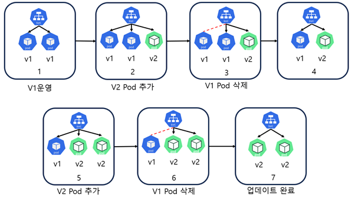
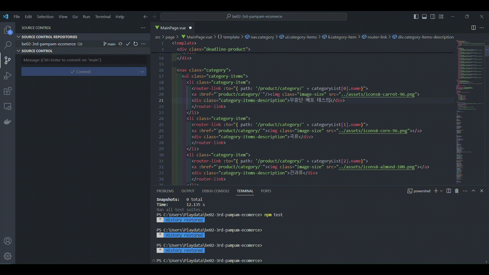
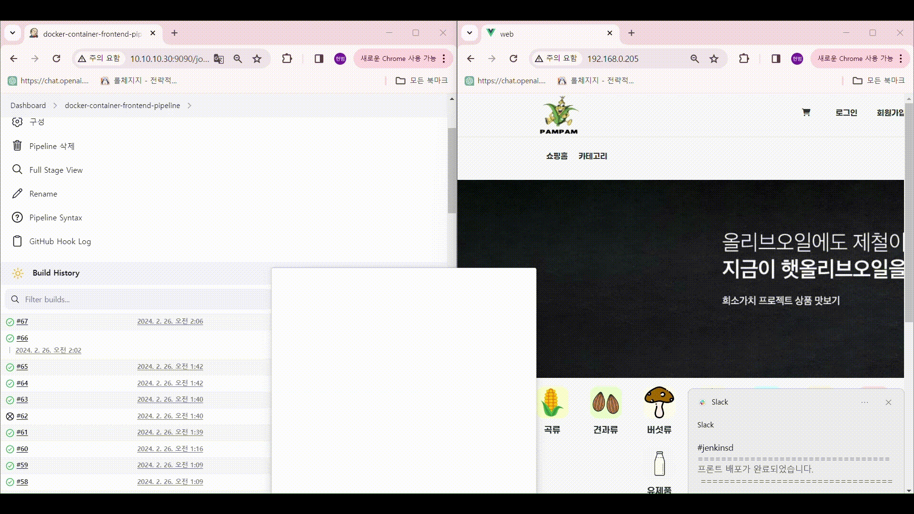

<h1 align="center">로컬 푸드 팜팜(Pampam) 🌽 데브옵스 아키텍쳐 구현
</h1>

 
 
 

## ✔️ 기술 스택 
 

 

## 📌프로젝트 목표

* 수작업으로 진행되는 배포 작업을 CI/CD를 적용한다면 자동화를 통해 배포 지속적인 형상관리를 쉽게할 수 있을 것입니다.

* 또한, 사람의 개입을 줄여 지속적 배포, 지속적 테스트 및 코드 관리에 드는 시간 및 인적 자원과 같은 리소스를 줄일 수 있게 됩니다. 따라서 CI/CD 적용이 목표입니다.

## 🖥️운영 환경 📖(펼쳐주세요)

    

 k8s 내부 아키텍처 

k8s 아키텍처 - 클러스터 구성

Master Node :1대 (192.168.0.205)

Worker Node: 3대 (192.168.0.206), (192.168.0.213), (192.168.0.214)

Node간 Connection을 위해 Calico CNI를 설치

Service 생성시 LoadBalance Type 사용을 위해 Metallb를 설치
 

 
서비스 아키텍처
User는 Load Balancer Service를 통해 Nginx Server에 접속 가능하다.

Nginx Server는 K8S 환경에 설치된 Spring Gateway와 Cluster IP를 통해 연결된다.

Spring Gateway는 Cluster Ip를 통해 Spring Eureka와 연결된다.

설치된 Spring Eureka Pod는 K8S에 설치된 각 Pod의 Cluster IP와 연결되어 Pod의 정보를 수집한다.

이 중에서 Member-Service와 Email-Service 및 Image-Service에서 Email-Service는 Kafka를 통해 Message를 송수신 한다.

또한 Member-Service와 Image-Service는 OpenFeign을 통해 Message를 송수신한다.

Pod들은 FrontEnd Pod를 제외하고는 Cluster IP를 통해 내부에서 연결되고, FrontEnd Pod는 Load Balancer를 통해 외부에서 접근 가능하다.

Data 저장을 위한 Database는 Replication 기능을 통해 Master DB(1대) 와 Slave DB(2대) 로 구성하였다.

 

    

 k8s 전체 서비스 아키텍쳐 

 

## ✨CI/CD의 필요성 및 시나리오 📖(펼쳐주세요)

## 💡 시나리오

본팀은 MSA Architecture를 활용하여 백엔드를 구성하였다.

각각의 모듈은 서로 다른 GitHub Repository에 저장되어 있다.

총 모듈은 8개로, Backend 관련 Repository는 7개 , Frontend 관련 Repository는 1개로 분할 되어있다.

1. 각각의 Repository에 저장된 코드를 개발자 변경한다.

2. 이후 각각의 Repository에 최신 버전의 코드를 Push한다.

3. Push를 감지한 GitHub Repository는 설정된 WebHook을 통해 Jenkins에 최신 버전의 코드가 Push 됐음에 따른 요청을 보낸다.

4. Jenkins Pipeline에 작성된 절차에 따라 동작이 이뤄진다.

   4-1) Jenkins Server는 연결된 GitHub의 최신 버전의 코드를 Clone한다.
   
   4-2) 예를 들어 연결된 GitHub Repository가 Backend라면 mvn package, FrontEnd라면 npm run build를 통해 해당 프로젝트를 Build한다.
   
   4-3) Build를 통해 생긴 jar 또는 dist 파일을 Dockerfile에 지정된 동작 순서로 Docker image를 생성한다.
   
   4-4) 생성된 Docker image를 Docker hub에 Push하기 위해 Docker hub에 Login 한다.
   
   4-5) 이후 Jenkins Server에서 등록 및 지정된 K8S Master Node에 배포에 쓰일 Deployment.yml을 전송한다.
   
   4-6) 수신한 K8S Master에서 전달 받은 Deployment.yml 파일들을 kubectl apply 명령어를 통해 적용시킨다.
   
   4-7) 작성한 Pipeline의 단계별 실행 결과를 Jenkins Server에서 설치된 Slack Plugin을 통해 Slack에 전송한다.

5-1) Rolling Update 방식을 통해 Backend의 무중단 배포를 구현했다.
     
5-2) FrontEnd는 Nginx의 reload 명령어를 통해 무중단 배포를 구현했다. 최신 버전의 html 파일은 reload 명령어를 통해 DownTime 없이 최신 버전의 코드를 적용하여 FrontServer를 동기화 할 수 있다.

    

 CI(Continuous Integration)/CD(Continuous Delivery)를 이용하는 이유 

CI/CD는 다음과 같은 장점이 있습니다.

* 소프트웨어 품질 향상: CI를 통해 버그를 빠르게 발견하고 수정할 수 있으므로 소프트웨어의 품질을 향상시킬 수 있습니다.
* 소프트웨어 안정성 향상: CD를 통해 소프트웨어가 더 자주 배포되므로 프로덕션 환경에서 발생하는 문제를 빠르게 발견하고 수정할 수 있습니다.
* 개발 생산성 향상: CD를 통해 개발자는 소프트웨어를 더 자주 배포할 수 있으므로 개발 생산성을 향상시킬 수 있습니다.
* 고객 만족도 향상: CD를 통해 소프트웨어가 더 자주 배포되므로 고객이 최신 소프트웨어를 사용할 수 있습니다.

 

    

 Rolling Update 배포 방식 선택 이유 

 

* 무중단 배포의 종류로는 Rolling Update, Blue-Green, Canary 배포가 있습니다. 3가지 방법 중에서 Rolling Update를 선택하였는데, 이 배포 방식에 대해 먼저 설명하겠습니다.

* Rolling Update 방식은 V1파드가 존재할 때 V2 파드를 하나 늘리고 V1 파드를 하나 줄이고 이를 반복하여 버전을 구버전에서 신버전으로 점진적으로 교체하는 방법입니다. 

* Rolling Update는 서비스의 지속성을 보장하면서도 새로운 기능을 제공할 수 있다는 점과 다른 방법들에 비해 자원을 적게 소비하면서도 무중단으로 서비스를 제공할 수 있다는 장점으로 인해 선택하게 되었습니다.

 Rolling Update 방식
 
 

* 다른 배포 방식인 Blue-Green 배포는 한 번에 버전을 교체하기 때문에 리소스를 많이 필요로 하며, Canary 배포 역시 새로운 버전을 일부 사용자에게 테스트하면서 점진적으로 서비스를 업데이트하기 때문에 두 버전이 동시에 존재해야 하고 Blue-Green과 같이 많은 리소스를 필요로 하기에 우리에게 적합한 배포방식이 아니었습니다.

* 따라서 우리팀은 MSA전환으로 인한 백엔드 및 DB 서버의 개수가 많아짐에 따라 자원을 더 효율적으로 사용 할 수 있는 Rolling Update 방식을 이용하게 되었고, 이를 통해 서비스의 지속성을 유지하면서도 자원을 효율적으로 활용할 수 있었습니다.

 

## 🎥CI/CD 테스트 및 결과 📖(펼쳐주세요)

    
최신 코드 깃허브에 푸시

  

    
무중단 배포 영상

    
슬랙에 알림

 

## 🧑‍🤝‍🧑 팀원

🐯 **정동섭** 🐶 **박현범** 🐺 **양호신** 🐱 **백송연** 🐧 **김도현**

<table>
  <tbody>
    <tr>
      <td align="center"><a href="https://github.com/Hosae0905"> <b> 팀장 : 양호신</b></a> </td>
      <td align="center"><a href="https://github.com/JungDongSeob"> <b> 팀원 : 정동섭</b></a> </td>
      <td align="center"><a href="https://github.com/ParkHyeonBeom"> <b> 팀원 : 박현범</b></a> </td>
     <tr/>
      <td align="center"><a href="https://github.com/SongYeonBaek"> <b> 팀원 : 백송연</b></a> </td>
      <td align="center"><a href="https://github.com/dohyun0408"> <b> 팀원 : 김도현 </b></a> </td>
    </tr>
  </tbody>
</table>

## 🌽 [팜팜 사이트 바로가기] 
(http://www.localfoodpam.kro.kr/)
